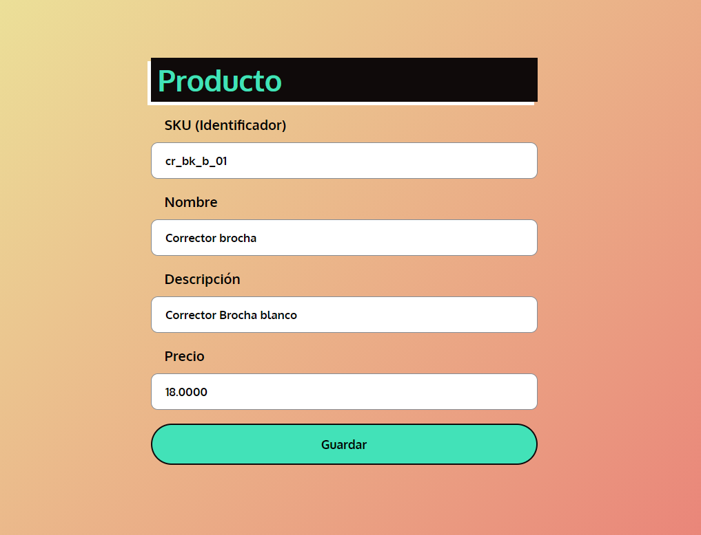

<!-- Please update value in the {}  -->

<h1 align="center">Papelería</h1>


<!-- TABLE OF CONTENTS -->

## Table of Contents

- [Table of Contents](#table-of-contents)
- [Overview](#overview)
  - [Built With](#built-with)
- [Features](#features)
- [How To Use](#how-to-use)
- [Acknowledgements](#acknowledgements)
- [Contact](#contact)

<!-- OVERVIEW -->

## Overview



Sistema para gestion de papeleria u tienda

En construcción.

### Built With

<!-- This section should list any major frameworks that you built your project using. Here are a few examples.-->

- [PHP](https://www.php.net/manual/es/intro-whatis.php/)

## Features

<!-- List the features of your application or follow the template. Don't share the figma file here :) -->

- Registra ventas
- Registra tickets

## How To Use

- Tener GIT
- Tener un servidor Apache
- Tener instalado una base de datos relacional ejemplo MySql

```bash
# Clone this repository
$ git clone https://github.com/emmanuelurbina/base_php

```

## Acknowledgements

<!-- This section should list any articles or add-ons/plugins that helps you to complete the project. This is optional but it will help you in the future. For exmpale -->

Para usarlo se recomienda tener conocimiento de SQL y php

## Contact

- Website [emmanuelurbina](https://emmanuelurbina.xyz)
- 
- 
